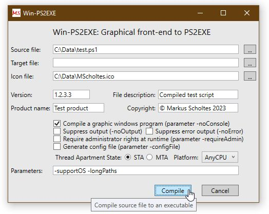

# Win-PS2EXE
Graphical frontend to PS1-to-EXE-compiler PS2EXE.ps1

#### Author: Markus Scholtes
#### Version: 1.0.0.0
#### Date: 2019-04-28

With [PS2EXE.ps1](https://gallery.technet.microsoft.com/PS2EXE-GUI-Convert-e7cb69d5) originally created by Ingo Karstein you can compile Powershell scripts to real Windows executables. **Win-PS2EXE** is a small graphical front end to the script. 

### Features and restrictions:
* **Win-PS2EXE** does not support all parameters of **PS2EXE.ps1**
* WPF application that compiles without Visual Studio or MSBuild on every supported Windows
* only one source file
* drag'n'drop for file names
* separate .Net 4.x and .Net 3.5x versions (since .Net 3.5x do not allow uncompiled event handlers)

### Screenshot:

### How to compile:
Start **Compile.bat** (in a .Net 3.5x environment use the version in folder DotNet3.5).

### How to use:
Ensure **PS2EXE.ps1** is in the same directory as **Win-PS2EXE.exe**.
Start **Win-PS2EXE.exe**.

